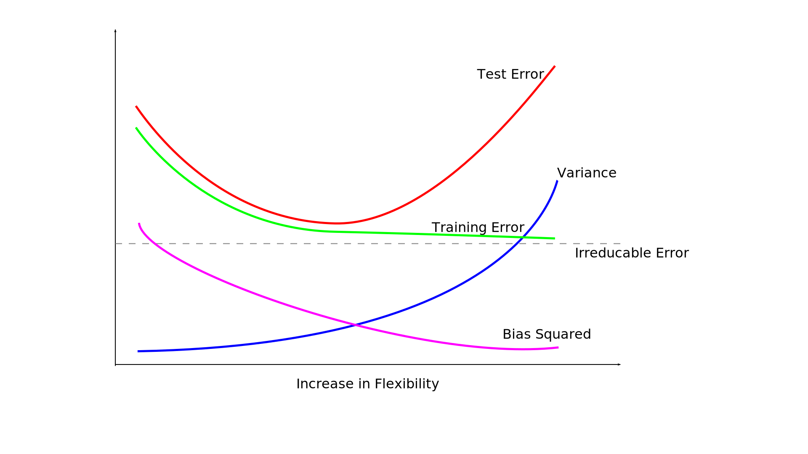

# Chapter 2 Answers

## Question 1

1. Better. Since the number of sample size is very large, a flexible model would be better as there would be less chance of overfitting it.
2. Worse. Here, a highly flexible model is likely to overfit the data. Hence, an inflexible model would be better in this case
3. Better. Since the relationship is highly non-linear, an inflexible model might not be able to properly capture the trends in the data. Hence, a flexible model would be better in this case.
4. Worse. Here, an inflexible model might be a better choice as a flexible model might try to follow the variance of the data too closely.

## Question 2

1. Regression; Inference; `n=500`; `p=4`
2. Classification; Prediction; `n=20`; `p=14`
3. Regression; Prediction; `n=52` (number of weeks in a year); `p=4`

## Question 3



**Irreducable error**: It is the error which occurs due to the noise or irregularities present in the data.

**Squared Bias**: Less flexible models have high bias as the predicted fit is highly limited by the model. Since, highly flexible models impose less of this restriction, bias decreases with increase in flexibility.

**Variance**: It is the error that is occurred in the data due to the values present in the test data. Changing the test data will give different fit for the model. Hence, with increase in flexibility, there is a higher chance of following this noise in the data too closely and thus overfitting the data. Hence, variance increases with model flexibility.

**Test Error**: It is the error that the model gives when we use training dataset again for testing as well. Since with flexible models, it is possible to overfit the data, the test error can reduce to a very small value (but more than the irreducable error).

**Training Error**: It is the error that the model gives when we use a new testing dataset. Since with increase in flexibility, there is increase in variance (due to overfitting), the training error first reduces (with less flexible models) and then increases again (with high flexible models).

## Question 4

1. Three applications of classification:
    1. Checking what factors lead to a student either passing/failing in an exam (Inference). The predictors can be the student's previous test scores, attendence and whether the student has studied a similar subject previously.
    2. Predicting whether or not a person will pay off a loan (Prediction). The predictors can be the loan amount, the person's credit score and monthly income.
    3. Predicting whether a person is healthy or is at a risk of weight-related health risks (Prediction). The predictors can be the person's height, weight, age and whether the person has been previously diagnosed with similar risks.
2. Three applications of regression:
    1. Finding out how many months a person might take to pay off a loan (Prediction). The predictors can be the loan amount, the person's credit score and monthly income.
    2. Figuring out the sales of a particular product and the factors that affect it (Inference). The predictors can be the current season, current economic conditions, price of the product, price of the competitor's product and aisle where the product is placed in the store.
    3. Figuring out the maximum height upto a crane can life an object (Prediction). The predictors can be the weight of the object, wind speed, ground type, ground strength and crane's weight carrying capacity.
3. Three applications of cluster analysis:
    1. Find clusters within readers of an online-library to recommend books based on the interests of similar users.
    2. Find clusters within the customers of an store to find what type of custers buy which type of products.
    3. Find which health problems usually occur together based on the patient's health profile.
    
## Question 5

Advantages of flexible models:
1. Can capture complex trends in data
2. Less bias introduced by the model
3. Less error for highly non-linear data

Disadvantages of flexible models:
1. Prone to overfitting (high variance)
2. Not suitable for data that is mostly linear

A highly flexible model might be preferred over a flexible model in cases where the data is non-linear along with a sufficiently large size of test data. In case the data is linear, or there isn't much test data, a less flexible model might perform better as there is less chance of overfitting the test data.

## Question 6

A parametric statistical learning approach involves choosing a functional form *f* which will be used to fit the data. The problem then reduces to finding the parameters for that function, which will reduce the error to a minimum. Whereas, a non-parametric approach involves forming a model by following the data points as closely as possible without the function getting too wiggly.

Since the parametric approach just requires the parameters of the function to be calculated for an accurate model, it requires less time. A non-parametric approach on the other hand makes no such assumptions about the function form of the *f*, and hence requires a lot more calculations to find an accurate fit. 

However, parametric approach suffer one problem: it is possible that the chosen function form of *f* that is not close to the true function and hence, it will never give an accurate answer.

## Question 7

Euclidean distance between observations and given point:
```r
dist(rbind(c(0, 3, 0),  c(0, 0, 0))) = 3             # Observation 1
dist(rbind(c(2, 0, 0),  c(0, 0, 0))) = 2             # Observation 2
dist(rbind(c(0, 1, 3),  c(0, 0, 0))) = 3.162278      # Observation 3
dist(rbind(c(0, 1, 2),  c(0, 0, 0))) = 2.236068      # Observation 4
dist(rbind(c(-1, 0, 1), c(0, 0, 0))) = 1.414214      # Observation 5
dist(rbind(c(1, 1, 1),  c(0, 0, 0))) = 1.732051      # Observation 6
```

With `K=1`, the point nearest to test point is observation 5. Hence, prediction = class of observation 5 = `Green`

With `K=3`, the 3 points nearest to test point are observation 5, 6 and 2. Hence, prediction = class with maximum occurrence = `Red` (since 2 out of 3 nearest observations are `Red`)

If the Bayes boundary in this problem is highly non-linear, then the best value for `K` would be small, since, a large `K` value will not be able to capture the quick changes that occur in the boundary in a non-linear case i.e. a large `K` value will average out all the small changes that occur in the real boundary and thus that information will be lost.